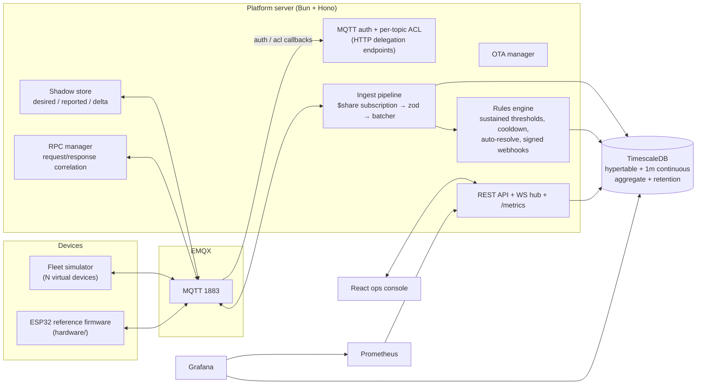

# IoT Fleet Platform

[](https://github.com/mortogo321/iot-fleet-platform/actions/workflows/ci.yml)

A from-scratch IoT device-fleet management platform: MQTT ingestion with broker **auth delegation**,
**device shadows** (desired/reported state), **RPC over MQTT**, simulated **OTA firmware rollout**,
a **rules engine** with signed webhooks, **TimescaleDB** time-series storage, a live **React ops
console**, and **Prometheus + Grafana** observability — everything runs with one command.

Built with Bun + TypeScript end to end (Hono API, native WebSocket pub/sub, `bun test`), EMQX,
TimescaleDB, React, Recharts, Docker Compose.

```
docker compose up --build
```

| Service | URL |
|---|---|
| Ops console (REST + WS + UI) | http://localhost:8080 |
| Grafana (anonymous viewer) | http://localhost:3000 |
| EMQX dashboard | http://localhost:18083 (admin / `iot-admin-1`) |
| Prometheus | http://localhost:9090 |

A simulated fleet self-provisions on first boot and starts streaming immediately. See
[docs/DEMO.md](docs/DEMO.md) for a 5-minute guided tour (shadows, RPC, OTA, alerts).

## Architecture



## What this demonstrates

**Device lifecycle & identity**
- Provisioning API issues per-device credentials; secrets stored as argon2id hashes, returned once.
- The broker holds **no credential state**: EMQX delegates connect auth *and* per-topic authorization
  to the platform over HTTP. Devices can only touch their own topics (`clientid == username ==
  deviceId` enforced); the ACL matrix is a pure, unit-tested function.
- Presence via MQTT Last Will: retained `online`/`offline` status, reflected live in the console.

**Telemetry pipeline**
- Server consumes `$share/ingest/telemetry/+` — a shared subscription, so ingest scales horizontally
  by adding server replicas without duplicate delivery.
- Boundary validation with zod (unknown fields rejected), device clock-skew guard, micro-batched
  multi-row inserts (500 rows / 500 ms), bounded buffer with drop-oldest backpressure, and
  `ON CONFLICT DO NOTHING` on the `(device_id, time)` key so QoS 1 redelivery stays idempotent.
- TimescaleDB hypertable + 1-minute continuous aggregate (powers the 1h/6h chart ranges) +
  30-day retention policy.

**Device shadow (digital twin)**
- Desired vs reported state with optimistic versioning (stale writes → 409), delta computation and
  `shadow/delta` push; devices apply and re-report. Reporting interval is shadow-driven — change it
  in the console and watch the cadence change.

**RPC over MQTT**
- Synchronous HTTP façade over async messaging: `POST /api/devices/:id/rpc` publishes a correlated
  request, awaits the device's response by `requestId`, times out with 504. `identify`, `readNow`,
  `getState`, `reboot` (device actually drops offline and LWT fires).

**OTA firmware rollout (simulated transfer, real state machine)**
- Register firmware versions, deploy via shadow `desired.firmwareVersion`; devices stream progress
  (`downloading → verifying → applying → rebooting → complete`) rendered as a live progress bar.

**Rules engine & alerting**
- Threshold rules with **sustained-duration** firing (must hold N seconds), per-device cooldown,
  and auto-resolve; scoped to a device, a device kind, or the whole fleet.
- Actions: WebSocket event, MQTT `alerts/{deviceId}` publish, and **HMAC-SHA256-signed webhooks**
  (`X-Signature`, `X-Event-Id`, `X-Timestamp`) with an SSRF guard that resolves the target host and
  refuses loopback/private/link-local/metadata addresses.

**Observability**
- Prometheus metrics (ingest rate, batch-flush latency histogram, buffer drops, alert firings, RPC
  outcomes, WS clients, MQTT connectivity) + a provisioned Grafana dashboard reading both
  Prometheus and TimescaleDB.

## MQTT topic contract

| Topic | Direction | Notes |
|---|---|---|
| `telemetry/{deviceId}` | device → platform | QoS 1, JSON, validated at the boundary |
| `devices/{id}/status` | device → platform | retained `online`/`offline`, LWT |
| `devices/{id}/shadow/reported` | device → platform | full reported state |
| `devices/{id}/shadow/delta` | platform → device | `{ version, state }` — keys to apply |
| `devices/{id}/rpc/request/{requestId}` | platform → device | correlated request |
| `devices/{id}/rpc/response/{requestId}` | device → platform | correlated response |
| `devices/{id}/ota/progress` | device → platform | rollout progress events |
| `alerts/{deviceId}` | platform → subscribers | fired alerts for integrations |

Any MQTT-capable device (ESP32, Zigbee2MQTT bridge, Tasmota, …) can join the fleet by speaking
this contract — `hardware/esp32-sensor/` is a minimal PlatformIO reference implementation.

## Security model

- **Devices**: per-device secret (argon2id-hashed), broker auth + topic ACL delegated to the
  platform, cross-device access denied by default (`no_match = deny`).
- **Broker-internal endpoints** (`/api/internal/mqtt/*`): shared-token header, constant-time compare.
- **Provisioning & HTTP ingest**: token / bearer-secret authenticated.
- **Webhooks out**: HMAC-signed payloads + SSRF guard on destinations.
- **Ops REST API / console**: deliberately unauthenticated in this POC — it's the demo surface.
  In production it sits behind your IdP (OIDC/SSO) like any internal admin plane.
- All dev credentials are env vars with safe defaults (nothing secret is committed); TLS (MQTTS/HTTPS)
  is a deployment concern documented below.

## REST API

| Method & path | Purpose |
|---|---|
| `POST /api/devices` | provision a device (returns the secret once) — `x-provisioning-token` |
| `GET /api/devices` · `GET /api/devices/:id` | fleet / device detail with latest telemetry |
| `GET /api/devices/:id/telemetry?minutes=60&bucket=raw\|1m` | history (raw or 1-minute aggregate) |
| `GET` / `PATCH /api/devices/:id/shadow` | read / update desired state (versioned) |
| `POST /api/devices/:id/rpc` | invoke a device method, await the response |
| `POST /api/devices/:id/firmware` | deploy a firmware version (OTA via shadow) |
| `GET` / `POST /api/firmware` | firmware registry |
| `GET /api/alerts` · CRUD `/api/rules` | alerting |
| `POST /api/ingest` | HTTP telemetry path for non-MQTT devices — `Bearer {deviceId}.{secret}` |
| `POST /api/internal/mqtt/auth` · `/acl` | EMQX delegation callbacks — `x-internal-token` |
| `GET /api/stats` · `GET /health` · `GET /metrics` | stats, health, Prometheus |
| `WS /ws` | live event stream (telemetry, presence, shadows, alerts, OTA, stats) |

## Configuration

Every variable is optional with a dev default — see [.env.example](.env.example). Highlights:
`SIM_DEVICE_COUNT` (fleet size), `SIM_ANOMALY_CHANCE` (hot-spike episodes that trip alert rules),
`MQTT_SHARED_GROUP`, `PROVISIONING_TOKEN`, `INTERNAL_TOKEN`, `WEBHOOK_SECRET`.

## Local development

```bash
bun install
docker compose up emqx timescaledb        # infra only
bun run dev:server                        # API + WS on :8080
bun run dev:simulator                     # fleet against localhost
bun run dev:web                           # Vite dev server on :5173 (proxies /api, /ws)
```

## Testing

```bash
bun run typecheck   # strict TS across all workspaces
bun test            # rules engine, shadow delta, ACL matrix, batcher, RPC correlation,
                    # SSRF guard + webhook signing, validation, broker integration (in-process)
bun run lint        # biome
```

The tricky logic is unit-tested with injectable clocks/writers (no sleeps), and the MQTT ingest
path has an integration test against an in-process broker. CI runs typecheck, lint, tests, and the
web build on every push.

## Scaling & production notes

Deliberate POC boundaries, and what changes in production:

- **Ingest scale-out**: already shared-subscription-based — run N server replicas; move the alert
  engine to keyed consumers (or postgres advisory locks) when replicated.
- **Transport security**: terminate MQTTS (8883) and HTTPS at the broker/edge; per-device X.509
  client certs are the next step after password auth (EMQX supports both against the same
  delegation endpoints).
- **Storage**: continuous aggregates for coarser rollups (1h/1d), compression policies on chunks
  older than a few days; `telemetry` is already partition-friendly (hypertable).
- **Shadow/RPC durability**: pending RPC state is in-memory (single-replica assumption in the POC);
  move correlation state to Redis/postgres for HA.
- **OTA**: transfer is simulated; a real rollout adds artifact storage + signed manifests +
  staged/canary cohorts — the shadow-driven state machine stays the same.

## Project structure

```
apps/server      Bun + Hono platform (ingest, shadows, RPC, OTA, rules, auth/ACL, WS, metrics)
apps/simulator   self-provisioning virtual fleet (telemetry, shadows, RPC, OTA, LWT)
apps/web         React ops console (fleet, device detail, alerts & rules)
packages/shared  single source of truth: topic contract, zod schemas, WS events, defaults
infra/           EMQX config, TimescaleDB schema, Prometheus + Grafana provisioning
hardware/        ESP32 reference firmware (PlatformIO)
```
